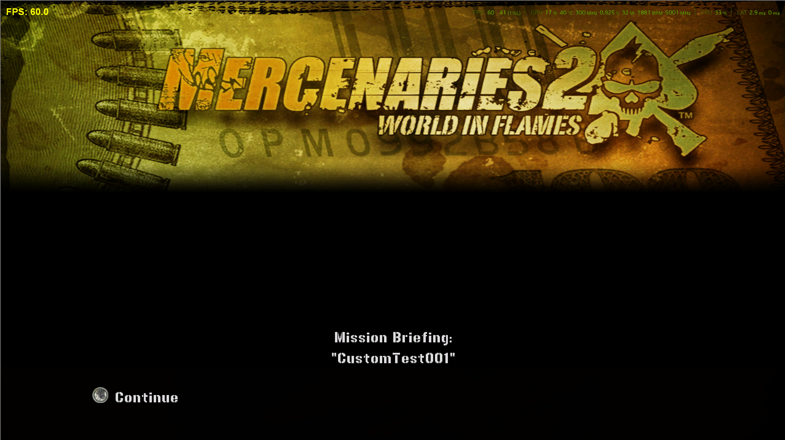

# Deep Dive: Adding a Custom Contract (research notes, not a working guide)

> **Status: broken. Do not use this as-is.** The mechanism below was confirmed working end to end —
> menu entry, accept flow, teleport-out, spawn/destroy/reward — in a single fresh-start test. But the
> script that produces that result **permanently breaks the lua bridge** (the external mod-loader layer
> itself, not just the in-game Lua VM) when the save being loaded spawns the player directly inside the
> PMC HQ. The only known fix once this happens is to remove the script from `scripts/OnLoad/` entirely.
> Root cause not found yet. This page is a record of what's been confirmed, what's still broken, and
> what to try next — not a drop-in recipe.

## The goal

Get a custom mission into the world's contract pool and make it startable the same way every real
contract is: by talking to a PMC HQ starter (Fiona/`PmcBoss`) and picking it from her briefing menu. On
purpose, the mission itself is as trivial as possible — destroy 3 cars spawned nearby, one flat reward —
so the interesting part is the *plumbing*, not the gameplay. The intent is a minimal, honest skeleton
other mods can build a real contract from, once it actually works.


**This diagram is a mid-investigation snapshot, not the final state** — it was drawn while still hunting
for the exact line inside `_UnloadSpiel` that wasn't returning, before `GetSpielFileName`'s real bug (the
`string.format("%02d", nil)` crash on a non-conforming mission ID, covered below) was actually found. The
"untested"/"stuck point" labels on `_UnloadSpiel` are now out of date — that call was fully resolved and
the flow was confirmed to complete end to end past this point. Still useful for the overall shape of the
accept sequence and as a record of the diagnostic process, just don't read the coloring on the right-hand
panel as current.

## The mechanism that's confirmed working

### Registering the mission

`WifMissionData.tMissionData` (`vz/wifmissiondata.lua`) is the master mission registry, keyed by mission
ID string. A custom `OnLoad` script can add its own entry directly:

```lua
WifMissionData.tMissionData.CustomTest001 = {
  sFactionId = "Pmc",
  sStarter = "PmcBoss",   -- Fiona
  bRepeatable = false,
  fOnActivate = CustomTest001_OnActivate,
  bContract = true,       -- see below, this has to be set by hand
}
```

`bContract` matters more than it looks like it should. In every real mission entry it's absent — it gets
computed once, for every mission, by `WifMissionData.Init()`:

```lua
for sMissionId, tMissionConfig in pairs(tMissionData) do
  local sFaction, bMissionType, nMissionNum = MrxUtil.ExplodeMissionName(sMissionId)
  tMissionConfig.bContract = bMissionType
end
```

That `Init()` pass already ran, once, before any `OnLoad` script's custom entry exists — so a custom
mission has to set `bContract = true` itself, or `WifMissionData.IsMissionAContract()` returns false for
it. That function gates whether accepting the mission calls `_oStarter:SetPendingContract(...)`, which is
what later tells [`WifPmcInterior.Exit()`](../vz/wifpmcinterior) where to actually send the player on the way out. Skip this and
the accept flow completes, but you're left standing in the HQ interior with nowhere to go — the first
symptom hit while building this.

### Getting it into the starter's menu

`WifMissionFlow.UnlockMission(sMissionName, tSaveData, bBlockingSequence)` (`resident/mrxmissionflow.lua`)
is the real entry point — not something to build by hand. It looks up the registry entry, builds an
`MrxTask` container + mission instance, auto-populates `tMissionConfig.tRewards` from
`MrxRewardData.GetRewards(sMissionName)` (a custom `MrxRewardData._tRewards.CustomTest001` entry is
picked up automatically, no extra work needed), wires wager win/loss settlement into the task's own
`tOnComplete`/`tOnCancel` lists, and finally calls `MrxStarterManager.RequestStarter(sStarter):AddBriefing(
sMissionName, sMissionTitle)` — confirmed to be exactly what makes the mission appear in Fiona's menu.
Triggering it from a live game (a console/dev command, or a one-shot `OnLoad` hook) is enough:

```lua
import("WifMissionFlow")
WifMissionFlow.UnlockMission("CustomTest001")
```

### Skipping `MrxTaskContract` entirely

A real contract sets `sModuleName` and lets the engine `dynamic_import()` its own module — that's how it
becomes an instance of `MrxTaskContract` instead of a bare `MrxTask`, which is where the free completion
fanfare, cash-reward math, and wager-settlement UI come from. This mod does **not** do that (see the hard
rule below), so it stays a bare `MrxTask`, driven by config callbacks instead of a subclass:

```lua
fOnActivate = CustomTest001_OnActivate,
```

Two things about this that aren't obvious until you hit them:

- **The callback is called with zero arguments.** `MrxTask._IssueStateChangeCallbacks` does
  `if fCallback then fCallback() end` — no `self`, nothing. The activation handler has to look up its own
  live instance a different way: `WifMissionFlow._tActiveMissions.CustomTest001.oMission`, confirmed
  non-`local` and populated synchronously by `UnlockMission`, well before activation ever fires.
- **No `MrxTaskContract` means no automatic reward payout, either.** This mod grants cash manually with
  `MrxPmc.AddCashQty(5000, false, "[Generic.Wagers]")` inside its own completion check, rather than relying
  on `MrxTaskContract.Complete2`'s reward-ledger logic (which isn't reachable without inheriting it).

### `tStartLocations` can be a literal coordinate, not just a named marker

Every real mission's `tStartLocations` is a list of *string* names — placed level markers, e.g.
`{"OilCon005_Startpoint_01", "OilCon005_Startpoint_02"}` — resolved to a position via
`Pg.GetGuidByName`/`Object.GetPosition`. A custom mission has no such marker placed in the compiled level.
Reading `MrxUtil.TeleportHeroesToLocations` directly settles it, though — it explicitly branches on
`type(vLocation)`, and a plain array table is a supported case, not just strings/userdata:

```lua
elseif sType == "table" then
  nX = vLocation[1]
  nY = vLocation[2]
  nZ = vLocation[3]
  nYaw = vLocation[4] or 0
end
```

So `tStartLocations = { {2776.8684, -13.8681, -873.5605} }` on the mission config is a legitimate way to
pin the post-accept teleport to a known, open location, without needing a real placed marker. This part
is source-confirmed but **not yet independently re-verified live** — see below.

## Hard rule #1: never call — or wrap — `dynamic_import`/`dynamic_remove`

These two are native functions with no decompiled Lua body, and they are the single most dangerous thing
touched in this whole investigation. Confirmed by two separate, real game crashes with an *identical*
signature (`AV READ target=00000029`, `EIP=0059C82A`):

1. Calling `dynamic_import` with a name that was never a real compiled asset crashes outright.
2. Wrapping/interposing `dynamic_import` — even passively, even calling straight through to the real
   thing with no logic changed — crashes on a **real, valid** asset name
   (`Spiel_MinorContract_Pmc31_Jennifer`, from the already-shipped `PmcCon031`). It's sensitive to its
   immediate caller's Lua environment, not just its arguments — adding one extra Lua stack frame between
   it and its real caller is enough to break it.

The practical consequence for this mod: it must never set `sModuleName` (which would make the engine call
`dynamic_import` on a name that was never compiled), and it must never wrap `dynamic_import` itself for
any reason, even diagnostically. Every workaround below is built around *avoiding* the call entirely,
never intercepting it.

## Hard rule #2: never write `return fOriginal(...)` in a wrapper

This one cost a real crash on an already-shipped mission (`PmcCon031`) before it was understood. Wrapping
any function like this:

```lua
SomeModule.SomeFunction = function(...)
  fOriginal(...)
end
```

...compiles the call as a **Lua tail call** — the current stack frame is replaced rather than a new one
pushed. This engine's own module system uses `getfenv(n)` in places (walking *n* stack levels to find a
module's environment), and a collapsed frame throws off that level-counting. The exact, reproducible
symptom: `:1: no function environment for tail call at level 2`, thrown from inside the engine's own
briefing code, not this mod's.

The fix, applied to every wrapper in this codebase from here on: never `return fOriginal(...)`. If the
return value is discarded by every real caller (checked case by case), call it as a plain statement. If
the return value is actually used (as with `GetSpielFileName`, below), capture it in a local and return
that local on a separate line — a genuine second statement, not a tail call:

```lua
local sResult = fOriginalGetSpielFileName(sMissionName)
return sResult
```

## Working around the briefing flow's assumption of a real spiel asset

Even with `sModuleName` skipped, selecting *any* mission from Fiona's menu still runs through
`mrxbriefing.lua`'s shared briefing flow, and two points in it assume every mission has a real, compiled
"spiel" (the briefing conversation/cutscene asset) on disk.

### `_LoadSpiel` — the load side

Selecting the mission calls `_BriefingSelected` → `_LoadSpiel`, which calls
`dynamic_import(GetSpielFileName(sMissionId), _FileLoaded)`. There's no such asset for a custom mission,
so this would crash exactly like the first `dynamic_import` test did. Fix: hijack `_LoadSpiel` itself (an
ordinary Lua function — the native is `dynamic_import`, not the function that calls it, so wrapping this
one is safe) and, only for `CustomTest001`, skip `dynamic_import` and call `_FileLoaded(nil)` directly:

```lua
if MrxBriefing._sSelectedMission == "CustomTest001" then
  if Net.IsServer() then
    Net.LoadMissionSpiel(WifMissionData.GetMissionIndexFromId(MrxBriefing._sSelectedMission), {})
  end
  MrxBriefing._FileLoaded(nil)
else
  fOriginalLoadSpiel()
end
```

Two things had to be confirmed by reading source, not assumed:

- **`_FileLoaded(nil)` doesn't hang.** Its pending-load counter starts at 0, and every block that would
  increment it is gated on `type(tFile) == "table"` — all skipped when `tFile` is `nil` — so the one
  unconditional `MrxUtil.LoadingCallback(_THIS)` call at the end fires `_StartSpiel` immediately.
  `_StartSpiel`'s own `_PlayCinematic` already has a generic placeholder fallback (a plain
  `"Mission Briefing: <name>"` caption) for a mission with no cinematic configured — confirmed directly
  from source, and confirmed live (the placeholder screen really does appear, followed by a correctly
  populated accept/decline dialog).
- **The `Net.LoadMissionSpiel` call is not optional.** The real `_LoadSpiel` calls this native before
  `dynamic_import`, and `_UnloadSpiel` (below) unconditionally calls the matching
  `Net.UnloadMissionSpiel(bExitingBriefing)` later, regardless of how the spiel was loaded. Skipping the
  load half while still hitting the unload half turned out not to actually be the bug (see below — the
  real bug was one line further down), but it's still the correct, paired thing to do, using the same
  empty-actor-list shape the real code produces when there's no `WifBriefingData` entry for the mission
  (which is exactly this mission's situation).

### `_UnloadSpiel` — the real bug, and how it was actually found

Exiting the briefing after accepting calls `_UnloadSpiel(true)`. This is where a genuine hang appeared —
no crash, no log output, just a permanently frozen screen — and finding the real cause took systematically
bracketing every single statement in the function with temporary logging, one at a time, rather than
guessing:

- `Net.UnloadMissionSpiel(bExitingBriefing)` — bracketed, confirmed returns normally.
- `_GetSelectedBriefingConfig()` — confirmed (by reading `Start()`, which aliases `mrxbriefing.lua`'s own
  `_tBriefings` to literally the *same table* as `oStarter:GetOfferedBriefings()`, and sets `.tConfig`
  on every entry up front) to reliably return `{}` for this mission, making every
  `if tConfig.tXxx then` block in the function a genuine no-op.
- `MrxUtil.SetupLoadingCallback`/`MrxUtil.LoadingCallback` — bracketed, confirmed both fire and return.
  (Also incidentally revealed that `_THIS` in this file is literally `mrxbriefing.lua`'s own module
  environment table — its `tostring()` dumps every function/constant the file defines.)
- `dynamic_remove(GetSpielFileName(sMissionId))` — the last line. Neutralizing `dynamic_remove` alone (a
  reasonable first guess, since nothing was ever `dynamic_import`'d for this mission to undo) produced
  **zero change** in the observed hang. That negative result was the actual clue: it meant execution
  never even reached that line.

The real bug was one call earlier, inside `GetSpielFileName` itself:

```lua
function GetSpielFileName(sMissionName)
  ...
  local sFaction, bContract, nNumber = MrxUtil.ExplodeMissionName(sMissionName)
  local sMissionType = bContract and "MinorContract" or "Job"
  return "Spiel_" .. sMissionType .. "_" .. sFaction .. string.format("%02d", nNumber) .. "_" .. sCharName
end
```

`ExplodeMissionName` expects the real naming convention — 3-letter faction + `"Con"`/`"Job"` + 3-digit
number, e.g. `PmcCon031`:

```lua
local sMissionType = string.sub(sMissionName, 4, 6)  -- "CustomTest001"[4..6] = "tom"
local sMissionNum = string.sub(sMissionName, 7, 9)    -- "CustomTest001"[7..9] = "Tes"
local nMissionNum = tonumber(sMissionNum)              -- tonumber("Tes") = nil
```

`"CustomTest001"` doesn't fit that shape at all, so `nMissionNum` comes back `nil`, and
`string.format("%02d", nil)` throws a hard Lua error. That error gets silently swallowed somewhere above
this call — no crash dump, no visible log — which is exactly what a real hang looks like from the outside.
It only ever surfaced here because the `_LoadSpiel` bypass above never calls `GetSpielFileName` for this
mission; `_UnloadSpiel` is the one and only place in the whole flow that does.

The fix is the same shape as the `_LoadSpiel` one — short-circuit it for this mission only, and be careful
about the tail-call rule since this function's return value is genuinely used:

```lua
MrxBriefing.GetSpielFileName = function(sMissionName)
  if sMissionName == "CustomTest001" then
    return "CustomTest001_NoSpiel"
  end
  local sResult = fOriginalGetSpielFileName(sMissionName)
  return sResult
end
```

## Confirmed working, once, end to end

With every workaround above in place, a single fresh-game-session test completed the *entire* chain for
the first time: Fiona's menu shows the entry → placeholder briefing screen → correctly populated
accept/decline dialog → accept → `_UnloadSpiel(true)` actually returns → `_EndBegin` → the real
`_oStarter:End(...)` → [`WifPmcInterior.Exit(1, false)`](../vz/wifpmcinterior) → teleport out → `fOnActivate` fires → cars spawn
→ destroying them fires the `Event.ObjectDeath` handler → cash granted → mission completes. Confirmed via
live `Loader.Printf` tracing, not inference.

![Fiona's root menu at the PMC HQ, showing "NEW! [CustomTest001.Title]" listed alongside the real "Universal Petroleum" and "Emplaced Weapons Challenge" briefing entries.](../img/customcontract1.png)

The untranslated `[CustomTest001.Title]`/`[CustomTest001.Terms.Summary]` bracketed strings visible here and
below are expected — this mod never registered real localization strings for those keys, so the game
displays the raw key name instead of translated text.



![The accept/decline confirmation dialog, correctly populated from this mod's own config: "[CustomTest001.Title]", Faction: PMC, "[CustomTest001.Terms.Summary]", Rewards: $5.0K, with Accept/Decline buttons.](../img/customcontract3.png)

Two of the three spawned cars landed obscured by geometry near the default HQ exit point, which is what
motivated the `tStartLocations` addition above — **that specific fix has not yet been re-verified live**,
because testing was derailed by the blocker below before a second full run could happen.

## The blocker: this permanently breaks the lua bridge on certain saves

After the mechanism above was confirmed working, loading a save that spawns the player directly inside
the PMC HQ (rather than walking in through the door) causes the **lua bridge itself** — the external
mod-loader layer, separate from the game's own Lua VM — to stop functioning, silently, with no crash and
no error. The game itself keeps running fine; only the bridge stops responding. It has to be removed from
`scripts/OnLoad/` entirely to restore it.

What's been ruled out:

- **Not the "boss starter auto-selects the first briefing entry" theory.** `_DisplayRootMenu` does
  auto-select `_tNames[1]` for a boss starter (`if _oStarter:IsBoss() then _BriefingSelected(_tNames[1]);
  return end`), which looked like a promising lead — if `CustomTest001` sorted first and the HQ
  auto-opened Fiona's menu on load, the accept flow could fire mid-load, in a much more fragile timing
  window than a live player interaction. Ruled out directly: nothing auto-triggers. The game loads fine
  and plays normally; the player still has to walk up and talk to Fiona manually. The bridge hang happens
  regardless, with no interaction at all.
- **Not something introduced by the later cleanup pass.** Reverted the script all the way back to the
  exact version that produced the one successful full test (full diagnostic logging, no
  `tStartLocations`) and reloaded the same problem save. Identical failure. Whatever this is, it predates
  every change made after the mechanism was first confirmed working — it's inherent to something in the
  core approach itself, not a regression from cleanup.

What's still unknown: why this specific save shape (spawns inside the HQ) triggers it, why the failure is
in the bridge layer specifically rather than the game's own Lua VM, and which part of this script is
actually responsible. Candidates not yet individually isolated: the hook-install guard
(`_G._bCustomContractTestHooked`) running very early during a save load that starts inside an interior
cell; whatever state `WifPmcInterior`/`mrxbriefing.lua` are in in the middle of restoring a save versus a
fresh level transition; or something about registering a `WifMissionData` entry before the interior's own
starter setup has finished for this particular save shape.

## Current script

This is what's currently sitting in `scripts/OnLoad/CustomContractTest.lua` — the version that produced
the one successful full run above, and also the version confirmed to still trigger the bridge-breaking
bug. Included here as the record of where this investigation currently stands, **not as something to
use**:

```lua
import("WifMissionData")
import("MrxRewardData")
import("WifMissionFlow")
import("MrxPmc")
import("MrxBriefing")
import("MrxUtil")

if not _G._bCustomContractTestHooked then
  _G._bCustomContractTestHooked = true

  local fOriginalLoadSpiel = MrxBriefing._LoadSpiel
  MrxBriefing._LoadSpiel = function()
    if MrxBriefing._sSelectedMission == "CustomTest001" then
      if Net.IsServer() then
        local nIndex = WifMissionData.GetMissionIndexFromId(MrxBriefing._sSelectedMission)
        Net.LoadMissionSpiel(nIndex, {})
      end
      MrxBriefing._FileLoaded(nil)
    else
      fOriginalLoadSpiel()
    end
  end

  local fOriginalUnloadSpiel = MrxBriefing._UnloadSpiel
  MrxBriefing._UnloadSpiel = function(bExitingBriefing)
    if MrxBriefing._sSelectedMission == "CustomTest001" then
      local fOriginalDynamicRemove = dynamic_remove
      dynamic_remove = function(sName) end

      local fOriginalGetSpielFileName = MrxBriefing.GetSpielFileName
      MrxBriefing.GetSpielFileName = function(sMissionName)
        if sMissionName == "CustomTest001" then
          return "CustomTest001_NoSpiel"
        end
        local sResult = fOriginalGetSpielFileName(sMissionName)
        return sResult
      end

      fOriginalUnloadSpiel(bExitingBriefing)

      dynamic_remove = fOriginalDynamicRemove
      MrxBriefing.GetSpielFileName = fOriginalGetSpielFileName
    else
      fOriginalUnloadSpiel(bExitingBriefing)
    end
  end
end

local function CustomTest001_OnActivate()
  local oMission = WifMissionFlow._tActiveMissions.CustomTest001.oMission
  local nCarsRemaining = 0

  local uChar = Player.GetLocalCharacter()
  local x, y, z = Object.GetPosition(uChar)

  local tCarOffsets = { {5, 0, 0}, {-5, 0, 0}, {0, 0, 5} }
  for i, tOffset in ipairs(tCarOffsets) do
    local uCar = Pg.Spawn("Veyron", x + tOffset[1], y + tOffset[2], z + tOffset[3])
    if uCar then
      nCarsRemaining = nCarsRemaining + 1
      oMission:_CreateEvent(Event.ObjectDeath, {uCar}, function()
        nCarsRemaining = nCarsRemaining - 1
        if nCarsRemaining <= 0 then
          MrxPmc.AddCashQty(5000, false, "[Generic.Wagers]")
          oMission:Complete()
        end
      end, {})
    end
  end
end

WifMissionData.tMissionData.CustomTest001 = WifMissionData.tMissionData.CustomTest001 or {
  sFactionId = "Pmc",
  sStarter = "PmcBoss",
  bRepeatable = false,
  fOnActivate = CustomTest001_OnActivate,
  bContract = true,
}

MrxRewardData._tRewards.CustomTest001 = MrxRewardData._tRewards.CustomTest001 or {
  nCash = 5000,
}
```

(Trimmed of the `Loader.Printf` diagnostic trace lines used while debugging, for readability here — the
deployed copy still has them, since they're what made every finding above possible to confirm rather than
guess at.)

## Open questions / where to pick this up

- **Root cause of the bridge-breaking bug — not found.** The next step is almost certainly to bisect by
  removing pieces of this script (the hook-install block, the `WifMissionData` registration, the
  `MrxRewardData` registration) one at a time against the same problem save, rather than reasoning about
  it further without new data.
- **Whether the `tStartLocations` fix actually resolves the obscured-car spawn issue — not re-verified.**
  Source-confirmed as a valid mechanism, but the live test that would prove it never happened.
- **Whether this reproduces on *any* save that starts inside an interior cell, or specifically the PMC
  HQ** — untested. Worth checking against a save that starts inside a different interior, if one exists.
- **Whether the hook-install guard (`_G._bCustomContractTestHooked`) surviving across a save load (as
  opposed to a fresh process start) plays any role** — plausible given how OnLoad script re-execution and
  global state were shown earlier in this investigation to persist across level reloads within the same
  running process, but not specifically tested against the bridge-breaking bug.

## General lessons, even though this mod doesn't work yet

1. **`dynamic_import`/`dynamic_remove` are not safe to touch, ever, beyond calling them exactly the way
   the engine already does.** Not with a made-up name, and not by wrapping them even transparently.
   Confirmed by two separate real crashes with the same signature.
2. **Never `return fOriginal(...)` in a function wrapper in this codebase.** It's a tail call, and this
   engine's `getfenv(n)`-based module system breaks in a specific, reproducible way when a wrapped
   function's frame collapses. Call the original as a plain statement, or capture and return its result
   on separate lines.
3. **When a function "should be safe" but something hangs anyway, bracket and log every single statement
   rather than guessing at which one.** The two real bugs found here (`bContract`, and
   `GetSpielFileName`'s `string.format("%02d", nil)`) were both found this way, and both were in
   completely unexpected places relative to the initial hypothesis.
4. **A negative result from a fix attempt is still real data.** Neutralizing `dynamic_remove` and seeing
   *no change at all* in the observed hang was what proved the bug was earlier in the function, not later
   — as useful as a positive confirmation would have been.
5. **This engine's config-driven callbacks (`fOnActivate`/`fOnComplete`/`fOnCancel`) pass zero arguments.**
   Don't expect `self`; look the live instance up by name instead.
