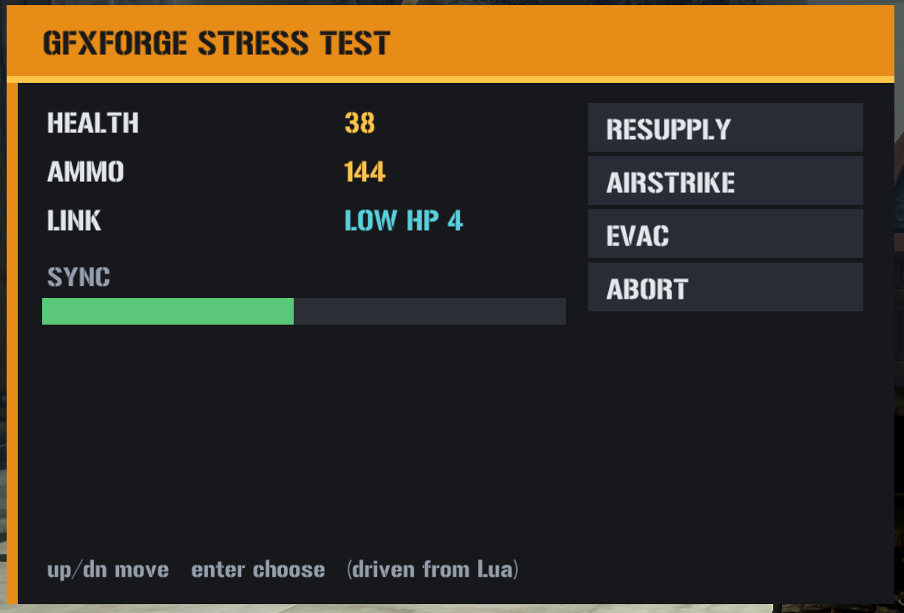

# Deep Dive: Custom UI — Authoring Scaleform Movies (gfxforge + gfx_tool)

> **Status: beta.** Confirmed rendering and driving live in-game end to end (layered
> shapes, imported-font text, live variable-bound updates, the bidirectional `fscommand`
> event bridge, script-driven clips, and menu navigation/selection all work on real
> hardware). There are now **two front-ends over one byte-identical codec** — a hosted
> **browser editor** ([gfx.mercs2.tools](https://gfx.mercs2.tools)) and the original
> **Python library** — and the browser tool also **generates the paired host Lua script**,
> so you can leave with both `hud.gfx` and a deployable `hud.lua`. Coverage is still
> intentionally narrow — see Limitations below before assuming something isn't supported yet.

Mercenaries 2's interface is **Scaleform GFx 2.x** (Flash 8 / ActionScript 2 / AVM1).
This system lets you build **brand-new UI movies from scratch — in your browser or in pure
Python — and drive them from the game's Lua**, with no Adobe Flash and no Scaleform
proprietary tooling. Three small tools cover the whole pipeline:

| Tool | Language | Role | Where |
|---|---|---|---|
| **gfxforge-web** | JavaScript (browser) | visual editor for `.gfx` **plus a generator for the host Lua**; zero-install, hosted | [gfx.mercs2.tools](https://gfx.mercs2.tools) · [repo](https://github.com/loganw234/mercs2-tools-gfxforge-web) |
| **gfxforge** | Python (stdlib only) | the same codec as a scriptable library / reference | [github.com/loganw234/mercs2-tools-gfxforge](https://github.com/loganw234/mercs2-tools-gfxforge) |
| **gfx_tool** | Rust | injects a `.gfx` into `vz-patch.wad` | [github.com/loganw234/mercs2-tools-gfxtool](https://github.com/loganw234/mercs2-tools-gfxtool) |

Everything is coupled only through the `.gfx` file. **gfxforge-web** is the easiest start —
design in a browser and export the `.gfx` plus a paired `hud.lua`; **gfxforge** is the same
encoder as a Python library (and the byte-for-byte reference the web port is checked
against); **gfx_tool** injects the finished movie. Both authors are generic (any GFx game);
only gfx_tool is Mercs2-specific WAD plumbing.



## How it fits together

```
author (gfxforge, Python)  ->  hud.gfx
        |                          |
        |                     inject (gfx_tool new)
        v                          v
   .gfx movie   ----------->   vz-patch.wad   ---->  game loads it as a
                                                     MrxGui.FlashWidget (SetSwfFile)
                                                          |
                    Lua -> movie: widget:CallActionScriptCallback("Fn", {args})
                    movie -> Lua: fscommand("evt", x)  caught by  SetFlashEventHandler
```

A movie is authored, injected as a WAD asset, loaded into a `FlashWidget` by a Lua
script, and then driven live: Lua calls ActionScript functions inside the movie, and the
movie fires events back to Lua.

## Current capabilities

### Authoring (gfxforge)

- **Vector graphics** — layered, solid-filled **rectangles** (`DefineShape3`, RGBA).
  This is the shape primitive; panels/bars/chrome are built by layering rectangles.
- **Text** — `DefineEditText` fields that **import the game's shared font**
  (`_normal_Font`, via `ImportAssets2`) rather than embedding one. Two kinds:
  - **static labels**, and
  - **variable-bound dynamic fields** that update whenever a variable changes (the hook
    Lua/AVM1 uses to push live values).
- **Named clips** (`clip()`) — script-addressable MovieClips (a rect wrapped in a
  `DefineSprite`) that AVM1 can move/scale/hide via `_x` / `_y` / `_xscale` / `_visible`
  (e.g. a progress bar or a selection cursor).
- **Buttons** (`button()`) — clickable `DefineButton`s that fire an `fscommand` event on
  click, with an optional hover colour.
- **Menus** (`menu()`) — a vertical list of buttons **plus a built-in movable selection
  highlight**, and generated `Move(dir)` / `Choose()` / `SetSelected(i)` functions the
  host calls to drive it (relative step, activate, or jump straight to an index). A
  from-scratch alternative to the native `MrxMultiPageMenu` system used everywhere else
  on this wiki (see [Your First Menu](../first-menu)) — reach for this one specifically
  when you want your own visual design instead of the native menu widget's look.
- **Behaviour (AVM1 bytecode)**, two ways:
  - **hand-assembled** via the `avm1` module (push / get-member / set-member /
    fscommand / define-function), or
  - **compiled from an AS2 subset** via the `compiler` module — supports literals,
    variables, `obj.member` / `obj[key]`, `+ - * / %`, comparisons, `&& ||`, unary
    `! -`, function + method calls, `fscommand`, assignment, `if/else`, `while`,
    `function` definitions and `return`, with correctly back-patched jumps.
- **The Lua ↔ movie bridge** (Mercenaries 2 side) — all three calls below are
  independently documented from the native side on
  [MrxGuiBase](../resident/mrxguibase) (`FlashWidget:SetSwfFile`,
  `FlashWidget:CallActionScriptCallback`, `FlashWidget:SetFlashEventHandler`):
  - Loading the movie: `widget:SetSwfFile("name.gfx", nil, nil)`.
  - Lua → movie: `widget:CallActionScriptCallback("Fn", {args})` calls an AS2 function.
  - movie → Lua: `fscommand("evt", value)` is caught by
    `widget:SetFlashEventHandler("evt", cb)`.

### Tooling

- **A tkinter visual editor** (`python -m gfxforge.gui`) — drag out boxes, place text and
  buttons, recolour, then **Export .gfx**.
- **A structural verifier** (`gfxforge.verify.verify_gfx`) — walks the whole tag stream
  *and* the AVM1 in every action block (function headers, code sizes, in-range jumps), so
  a malformed export is caught with no game needed.
- **A one-command build/deploy CLI** (`tools/pack.py`) — generate → verify → optional
  `gfx_tool` round-trip → optional deploy (inject into the patch WAD, install a paired
  `OnKey` Lua, bind a key).
- A self-test suite (`tests/test_build.py`).

### Browser editor (gfxforge-web)

The **same codec compiled for the browser**, hosted at
**[gfx.mercs2.tools](https://gfx.mercs2.tools)** — zero install, works offline, and its
`.gfx` output is byte-for-byte identical to the Python library's. On top of authoring it adds:

- A **canvas editor** — place boxes / text / buttons / clips / menus, drag and resize, edit
  properties, snap to grid, trace over a **reference screenshot**, with a live **Play mode**
  that runs the movie's AVM1 in a JavaScript interpreter so you can click buttons and call
  functions without launching the game.
- **Host-Lua generation** — builds the paired `OnKey` script straight from your scene: the
  `FlashWidget` spawn, one `SetFlashEventHandler` per event, `CallActionScriptCallback`
  stubs annotated with what each updates, and a working keyboard menu key-watch. The
  generated glue re-syncs as you edit; your own code lives in preserved `--#user` blocks, so
  you leave with both `hud.gfx` **and** a deployable `hud.lua`.
- A **`.gfx` importer** — scrapes an existing movie back into an editable project (shapes /
  text / clips / buttons, positioned by their placement matrices). External images, external
  gradients, and compiled AVM1 aren't recoverable and are reported as notes.
- An **extended AS2 compiler** — adds `for` loops, arrays, and `break` / `continue` on top
  of the Python subset.

Gradient and image tools exist in the codec but are **disabled in the editor** because they
don't render as inline SWF in GFx (see Limitations); solid fills, rounded corners, strokes,
text, clips, buttons, and menus all render.

### Injection (gfx_tool)

`find` / `inspect` / `extract` / `build` (override an existing movie) / `new` (add a movie
under a brand-new asset name). Movies are injected as ASET **`type_id = 23`**
(`cfx_pack`) assets in `vz-patch.wad`; injects are proven byte-identical on re-extract.

### Confirmed working in-game

A stress-test panel that combines all of the above renders and runs in Mercenaries 2.
Confirmed on real hardware: **layered shapes render; imported-font text renders;
variable-bound text updates live when Lua pushes values; the bidirectional `fscommand`
event bridge fires (movie → Lua → movie round trip); and menu navigation/selection work
(host drives selection, the movie reports the chosen index).** (The selection highlight
initially drew *behind* the opaque buttons and was changed to an opaque accent marker
drawn on top.)

A second panel — an "OPERATOR STATUS" HUD authored **entirely in gfxforge-web** (background
panel, two live text fields, a script-scaled health bar, a button, and a keyboard-navigable
menu) together with its **generated** `hud.lua` — is also confirmed on real hardware,
including the show/hide toggle and Up/Down menu navigation.

## How it works (technical)

### The movie format

A `.gfx` is a **SWF tag stream** with a `GFX` magic and a Scaleform **`ExporterInfo`**
(tag 1000) as the required first tag. A minimal renderable movie is:
`RECT + framerate + framecount`, then `ExporterInfo(1000)` / `FileAttributes(69)` /
`SetBackgroundColor(9)` / `DefineShape3(32)` / `PlaceObject2(26)` / `ShowFrame(1)` /
`End(0)`. gfxforge writes uncompressed `GFX v8` and tags the `ExporterInfo` version as
**`0x0207`** to match the retail (GFxExport 2.07) era.

### The one detail that matters most: PlaceObject2

The long-standing "custom movies render blank" problem came down to **one wrong flag bit
in `PlaceObject2`**. The flags byte must set **`HasCharacter` (`0x02`)** to actually place
a character on the display list; the value `0x40` is `HasClipDepth`, not HasCharacter.
Movies that used `0x40` defined their shapes but never placed them — a clean blank with no
error. gfxforge always emits `0x06` (`HasCharacter | HasMatrix`) with a real matrix.

### Text: import, don't embed

The shared font `_normal_Font` is a `DefineFont3` the game loads globally (from
`GFxFontLib`). Movies **import** it with `ImportAssets2` and reference it from
`DefineEditText`; nothing is embedded. Setting a field's *variable name* binds it, so
`_root.<var> = value` (from AVM1, driven by Lua) updates the display.

### Behaviour and the bridge

GFx runs AVM1. gfxforge emits `DoAction` blocks that define functions the host calls.
`fscommand(cmd, val)` compiles to an `ActionGetURL2` with a `"FSCommand:"` URL, which the
game routes to the handler registered by `SetFlashEventHandler`. Note there is **no
`SetFlashVariable`** in the Lua bridge — dynamic text is changed by calling an AS2 function
(or a variable-bound field), not by setting a variable directly.

### Input

Native mouse/controller routing to a **HUD** `FlashWidget` is not confirmed. In practice
input is driven from Lua: the lua-loader can watch keys (`Loader.IsKeyDown` /
`Loader.PopKeyEvents`, the same edge-triggered press-tracking idiom the
[cheat-menu](../cheat-menu#fun)'s own toggles use) and call `Move`/`Choose`/`SetSelected`
on the movie. This makes buttons and menus usable regardless of native input — the same
"no native continuous input" wall the [Freecam deep dive](freecam) hit and solved a
different way (hijacking the PDA widget's own input event instead of polling keys).

## Worked example

In **gfxforge-web** you'd draw this on the canvas and let it generate the Lua; the Python
API below is the equivalent for scripted or batch authoring.

**Author** (Python, gfxforge):

```python
from gfxforge import Movie, compiler

m = Movie(200, 60, name="hp", background=(22, 24, 28))
m.rect(0, 0, 200, 20, fill=(232, 140, 24))
m.text(6, 3, "HEALTH", size=13, color=(25, 25, 25))
m.text(6, 26, "--", size=14, color=(255, 196, 72), var="hp_val")   # dynamic field
m.script(compiler.compile_source('''
    function SetHealth(n) {
        _root.hp_val = n;
        if (n < 25) { fscommand("warn", n); }
    }
'''))
m.save("hp.gfx")
```

**Inject** (gfx_tool):

```
gfx_tool new --wad vz.wad --name hp --movie hp.gfx --out vz-patch.wad
```

**Drive** (Lua, in a widget that loaded `hp.gfx`):

```lua
widget:CallActionScriptCallback("SetHealth", { 87 })   -- updates the field
widget:SetFlashEventHandler("warn", function(_, v)      -- fires when health < 25
  -- react in Lua
end, {})
```

## The stress-test script

The panel described under "Confirmed working in-game" above — layered shapes, static and
dynamic text, an AVM1-driven scale bar, a compiled menu, and the full bidirectional event
bridge, all in one screen — is exercised end to end by a paired script/asset:
`stress_test.py` (gfxforge, authors the `stress.gfx` movie this loads — not reproduced
here) and `stress_test.lua`, the host side, in full below. It's an ordinary
[OnKey script](../first-mod#step-3-trigger-it-on-demand-with-onkey) like any other on
this wiki: drop it in `scripts/OnKey/`, map a key in `lua_loader.ini`, press it.

A few things worth knowing before the listing:

- **`MrxGuiBase.FlashWidget:new()`, `AddWidget`, and `MrxGuiManager.AddWidgetToHud`** are
  the same widget plumbing every native HUD element is built from — see
  [MrxGuiBase](../resident/mrxguibase) and [MrxGuiManager](../resident/mrxguimanager). A
  `FlashWidget` is just a `Widget` subclass pointed at a `.gfx` file.
- **The value cycle and the key-poll loop are both a self-rescheduling
  `Event.Create(Event.TimerRelative, ...)`** — `TimerRelative` only fires once, so
  `tick()`/`poll()` each re-arm their own next call as their first line. Same pattern
  documented on [Engine Namespaces: Event](../namespaces/event#the-4-core-functions),
  confirmed reliable in [Snippets](../snippets#react-to-an-event-instead-of-polling).
- **Menu interaction never touches the native `MrxMultiPageMenu`** (see
  [Your First Menu](../first-menu) if that's what you actually want instead) — Up/Down/
  Enter are polled with `Loader.IsKeyDown` and translated into `Move`/`Choose` calls
  straight into the movie's own compiled AS2 menu via `CallActionScriptCallback`. The
  movie owns selection state and visuals; Lua only ever says "up," "down," or "pick this
  one," and listens for the `choose` event fired back. (`SetSelected` is also available
  for jumping straight to an index — the bonus `menuClick` handler in the script uses it.)
- **`_G.STRESS` is why a second press of the key pauses/resumes instead of rebuilding** —
  the same `_G`-guard persistence idiom used by every stateful `OnKey` script on this
  wiki (see [Your First Menu](../first-menu#three-pieces-combined) if this is new).

```lua
-- GFXFORGE STRESS TEST (host side) — pairs with stress_test.py, asset "stress".
-- Drop in <game>/scripts/OnKey/ and map a key in lua_loader.ini ([OnKey]
-- stress_test.lua=home). Get in-world, press Home to build it; Home again
-- pauses/resumes the value cycle.
--
-- Exercises, end to end:
--   * shapes + static/dynamic text render (SetHealth/SetAmmo -> bound fields)
--   * an AVM1-scaled bar             (SetSync -> _root.bar._xscale)
--   * a compiled menu                (Move/Choose/SetSelected)
--   * movie -> Lua events            (warn, choose) via SetFlashEventHandler
--   * input with no native mouse     (lua-loader key watch -> Move/Choose)
local KEYVAL = "home"                       -- must be in the first 10 lines

import("MrxGuiBase")
import("MrxGuiManager")

local VK_UP, VK_DOWN, VK_ENTER = 0x26, 0x28, 0x0D   -- arrows + Enter (tune freely)
local CYCLE = 0.30                                   -- value-cycle interval (s)
local POLL  = 0.05                                   -- key-poll interval (s)
local LABELS = { [0] = "RESUPPLY", [1] = "AIRSTRIKE", [2] = "EVAC", [3] = "ABORT" }

_G.STRESS = _G.STRESS or { step = 0, paused = false }
local S = _G.STRESS

local function call(fn, args)               -- Lua -> movie (guarded)
  if S.w then pcall(function() S.w:CallActionScriptCallback(fn, args or {}) end) end
end

local function build()
  local player = Player.GetLocalPlayer()
  local w = MrxGuiBase.FlashWidget:new()
  pcall(function() w:SetOwner(player) end)
  w:SetLocation(30, 60, 430, 330)           -- 400x270 movie
  w:SetSwfFile("stress.gfx", nil, nil)
  MrxGuiBase.AddWidget(w)
  pcall(function() w:SetVisible(true) end)
  pcall(function() MrxGuiManager.AddWidgetToHud(player, w) end)
  S.w = w
  -- movie -> Lua events
  pcall(function() w:SetFlashEventHandler("warn", function(_, v)
    call("SetStatus", { "LOW HP " .. tostring(v) })
    Loader.Printf("[stress] <- warn hp=" .. tostring(v))
  end, {}) end)
  pcall(function() w:SetFlashEventHandler("choose", function(_, v)
    local opt = LABELS[tonumber(v) or 0] or tostring(v)
    call("SetStatus", { "SEL " .. tostring(opt) })
    Loader.Printf("[stress] <- choose i=" .. tostring(v) .. " (" .. tostring(opt) .. ")")
  end, {}) end)
  pcall(function() w:SetFlashEventHandler("menuClick", function(_, v)   -- bonus mouse path
    call("SetSelected", { tonumber(v) or 0 }); call("Choose", {})
  end, {}) end)
  return w
end

-- value cycle: sweeps HEALTH (dips < 25 to trigger the warn round-trip), AMMO, SYNC
local function start_cycle()
  if S.cycleOn then return end
  S.cycleOn = true
  local function tick()
    Event.Create(Event.TimerRelative, { CYCLE }, tick)
    if S.paused or not S.w then return end
    S.step = (S.step or 0) + 1
    call("SetHealth", { 100 - (S.step * 11) % 100 })   -- number, so AS2's n<25 works
    call("SetAmmo",   { 30 + (S.step * 17) % 300 })
    call("SetSync",   { (S.step * 9) % 101 })           -- 0..100 -> bar._xscale
  end
  tick()
end

-- menu nav via the lua-loader key watch (edge-triggered)
local function start_keys()
  if S.keysOn then return end
  S.keysOn = true
  local pu, pd, pe = false, false, false
  local function poll()
    Event.Create(Event.TimerRelative, { POLL }, poll)
    if not S.w then return end
    local u, d, e = Loader.IsKeyDown(VK_UP), Loader.IsKeyDown(VK_DOWN), Loader.IsKeyDown(VK_ENTER)
    if u and not pu then call("Move", { -1 }) end
    if d and not pd then call("Move", { 1 }) end
    if e and not pe then call("Choose", {}) end
    pu, pd, pe = u, d, e
  end
  poll()
end

local ok, err = pcall(function()
  if not S.w then
    build(); S.paused = false
    start_cycle(); start_keys()
    Loader.Printf("[stress] built; cycle + key watch running (up/dn move, enter choose)")
  else
    S.paused = not S.paused
    Loader.Printf("[stress] value cycle " .. (S.paused and "PAUSED" or "RESUMED"))
  end
end)
if not ok then Loader.Printf("[stress] ERROR: " .. tostring(err)) end
```

## Limitations / not yet supported

- **Fills**: solid colours are the reliable primitive; rounded corners and outline strokes
  also render. **Gradients do not** — GFx externalizes gradients (`DefineExternalGradient`),
  and the inline SWF gradient the editors can emit renders flat, so gradient fills are
  disabled in gfxforge-web. Arbitrary vector paths aren't emitted either.
- **Fonts**: the game's shared `_normal_Font` only — no arbitrary embedded typefaces
  (that needs a TrueType→glyph converter, not built).
- **Bitmaps / images**: not authored as inline pixels. GFx keeps images as *external
  textures* (ASET `type_id 27`), a separate injection pipeline; DXT compression also requires
  Scaleform's `gfxexport`. (gfxforge-web can encode an inline `DefineBitsLossless`, but GFx
  renders it blank for the same external-texture reason, so the image tool is disabled.)
  Pure vector + text + scripting needs none of this.
- **AVM1 compiler**: `&&` / `||` are not short-circuit; calls are by name or method. The
  Python subset has no `for` loop; the browser build adds `for`, arrays, and `break` /
  `continue`.
- **Input**: a HUD `FlashWidget` gets no mouse, so buttons and menus are driven from the
  lua-loader key watch (edge-triggered `Loader.IsKeyDown`), not clicks — see Notes & gotchas.
- Movies are single-frame (no timeline/tween animation exposed, though AVM1 can animate a
  clip's properties over time).

## Notes & gotchas

- **A HUD widget composites transparent — the stage colour is not a background.** A movie's
  `SetBackgroundColor` is *not* painted when it's loaded into a HUD `FlashWidget`; the widget
  overlays the game world with a transparent background, so the world shows through wherever
  no shape is drawn. For a solid panel, draw a **full-stage rectangle as the bottom layer** —
  don't rely on the stage/background colour, which is only a preview aid in the editors.
- **Hide/show with your own state flag, not `IsVisible`.** `Widget:SetVisible(bool)` works
  (it's how you show a widget), but there is **no `IsVisible`** — the getter is
  `Widget:GetVisible()` (see [MrxGuiBase](../resident/mrxguibase)). And even that is a trap
  for a toggle: engine getters return `1` / `0`, and in Lua `not 0` is `false` (only `nil` /
  `false` are falsy), so `SetVisible(not w:GetVisible())` never flips. Keep a boolean in your
  `_G` state table and call `SetVisible(S.shown)`.
- **Menu keyboard navigation must be wired by hand.** The highlight only moves when the host
  calls `SetSelected(i)` / `Move` / `Choose`; a HUD `FlashWidget` gets no mouse. Poll
  `Loader.IsKeyDown` for Up / Down / Enter on a self-rescheduling timer, **edge-trigger** it
  (compare against the previous frame so one press moves exactly one row — a raw poll fires
  ~20×/sec), track the selected index, clamp it to `[0, rows-1]`, and call `SetSelected`. The
  stress-test listing above is a complete example.
- **`gfxexport` (Scaleform's proprietary exporter) is not required** for vector + text +
  scripting — only for image-heavy movies. Everything above is emitted directly in Python.
- Deploying a patch = copy the built WAD to `<game>/data/vz-patch.wad`; revert by deleting
  it. A **new** `OnKey` Lua script + its `lua_loader.ini` binding only register on a game
  **relaunch**.
- gfxforge is MIT and dependency-free; gfx_tool is MIT and depends (as a git dependency,
  with permission) on the Mercenaries-Fan-Build `mercs2-wad-simulator` `mercs2_formats`
  crate for the WAD/UCFX/ASET plumbing.
