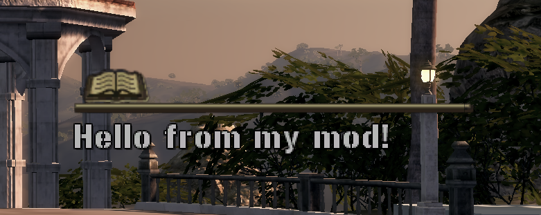
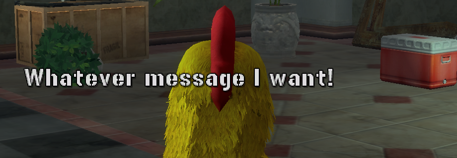

# Snippets

Small, copy-pasteable one- or few-liners for common tasks. Run any of these from `lua_console.py` first
to see them work, then move them into an `OnLoad`/`OnKey` script once you know what you want. If you
haven't read [Your First Mod](first-mod) yet, that's where `OnLoad`/`OnKey`/`KEYVAL` are explained — this
page assumes you already know where a snippet like this would go.

Looking for a complete, ready-to-drop-in script instead of a building block? See
[Sample Scripts](sample-scripts).

Every snippet below is a real call pattern pulled from the game's own scripts, not guessed — but "real
call pattern" isn't the same as "tested by a human in-game." Check the banner at the top of this page.
Headings below stay expanded/collapsed independently — click one to open it.

## Print debug info

<details class="script-entry" markdown="1">
<summary>One line to confirm your script is running and inspect a value.</summary>

The simplest possible thing — confirms your script is running and lets you inspect a value:

```lua
Loader.Printf("[mymod] cash = " .. Player.GetCash())
```

</details>

## Read / give cash

<details class="script-entry" markdown="1">
<summary>Read the player's cash, or add to it, via MrxPmc.</summary>

`MrxPmc` is a `resident/` module, not an engine namespace, so it isn't automatically visible from a
console chunk or `OnLoad`/`OnKey` script — `import()` it yourself first (confirmed by live testing: skip
this and you get `attempt to index global 'MrxPmc' (a nil value)`). See the
[Glossary](glossary#importname) if that's surprising.

```lua
import("MrxPmc")
local nCurrent = MrxPmc.GetCashQty()
MrxPmc.AddCashQty(10000)              -- relative: add 10,000
-- MrxPmc.AddCashQty(nCurrent * -1)   -- zero it out, if you ever need to
```

Confirmed by live testing: the lower-level `Player.SetCash(...)`/`Player.AddCash(...)` also genuinely
change the balance, but skip the HUD refresh `MrxPmc.AddCashQty` triggers — the on-screen number won't
visibly update even though the value changed. Use `MrxPmc.AddCashQty`/`AddFuelQty`, not the raw
`Player.*` setters, if you want what's displayed to actually update.

</details>

## Read / give fuel

<details class="script-entry" markdown="1">
<summary>Read the player's fuel, or add to it, raising the capacity first if needed.</summary>

Fuel has both a current quantity and a capacity — raising the quantity past the capacity does nothing
until you raise the capacity too. Same `import()` requirement as cash above:

```lua
import("MrxPmc")
local nFuel = MrxPmc.GetFuelQty()
local nCap  = MrxPmc.GetFuelCapacity()
MrxPmc.SetFuelCapacity(9999, true)    -- raise the cap first
MrxPmc.AddFuelQty(5000)               -- then add fuel
```

</details>

## Toggle infinite ammo

<details class="script-entry" markdown="1">
<summary>Turn infinite reserve ammo on or off for a character.</summary>

```lua
Object.SetInfiniteAmmo(Player.GetPrimaryCharacter(), true)   -- on
-- Object.SetInfiniteAmmo(Player.GetPrimaryCharacter(), false) -- off
```

**Confirmed working by live testing** — with one nuance: this doesn't mean "never reload." The magazine
you're currently firing still empties normally and still needs a reload; what's infinite is your reserve
ammo count, which stays maxed instead of depleting. Grenades behave the same way (infinite reserve, but
you still throw them one at a time). If you want the mag itself to never empty, this call alone isn't
enough — that'd need a different/additional call, not yet identified.

If you're in co-op and want to affect the second player too, there's a matching
`Player.GetSecondaryCharacter()`.

</details>

## Get your current position

<details class="script-entry" markdown="1">
<summary>Read the player's current world coordinates.</summary>

Useful for debugging, or as a building block for anything that needs to know where the player is:

```lua
local x, y, z = Object.GetPosition(Player.GetLocalCharacter())
Loader.Printf(string.format("[mymod] pos = %.1f, %.1f, %.1f", x, y, z))
```

**Confirmed working by live testing** — returns real, sane coordinates matching the player's actual
in-world position.

</details>

## Put a marker/blip on an object

<details class="script-entry" markdown="1">
<summary>Add a minimap/radar blip to any object.</summary>

This is the same pattern the game's own radar-objective modules (`crate`, `blippable`) use to put a
minimap/off-screen blip on a world object:

```lua
Marker.AddBlip(uGuid, "temp_radar_icon_airplane", 48, 255, 255, 255, 255, 0.5, 16, 20)
```

`uGuid` is the target object's handle and `"temp_radar_icon_airplane"` is a texture name (swap for
whatever icon you want, assuming it exists as a loaded asset). The trailing numeric arguments are copied
verbatim from working game code (size/color/alpha/scale-ish values) — their exact individual meaning
hasn't been independently confirmed argument-by-argument, so treat this as "known to work with these
values" rather than a fully documented signature. If you need a different visual result, adjust one
argument at a time and observe.

**Confirmed working by live testing** — tested with `uGuid = Player.GetLocalCharacter()` (blip on your
own character). The blip does render, but at ground level under the object — on a character, it can be
visually obscured by nearby geometry unless you jump or look from above. Don't assume "no icon visible"
means it failed; check the minimap itself (blips render there even when the in-world icon is hidden by
geometry) before concluding the call didn't work.

</details>

## React to an event instead of polling

<details class="script-entry" markdown="1">
<summary>Fire a callback once, later, instead of checking a condition every frame.</summary>

The engine event pattern used throughout `resident/` — fire a callback once, later, instead of checking
a condition every frame:

```lua
Event.Create(Event.TimerRelative, {2}, function()
  Loader.Printf("[mymod] two seconds later")
end, {})
```

**Confirmed working by live testing** — fires exactly once, at the correct delay. Tested at 2s, 5s, and
20s, all reliable.

<details class="lua101" markdown="1">
<summary>New to Lua? Click to expand</summary>

That `function() ... end` sitting *inside* the `Event.Create(...)` call, with no name of its own, is
called an **anonymous function** — a function defined right where it's used instead of with
`function Foo() ... end` somewhere else. `Event.Create` takes it as an argument and calls it later,
once the timer fires, exactly like `MrxMultiPageMenu.AddOption("Add cash", function(nCash) ... end, ...)`
does elsewhere in this wiki. This is an extremely common pattern in this codebase: "here's some code to
run later, when X happens" — the callback function *is* the "later."

You'll also see `local KEYVAL = "insert"` and `local nCurrent = ...` elsewhere on this page.
`local` limits where a name is visible — leave it off and the name becomes global (visible from
anywhere), which is almost never what you want for a throwaway variable inside one script. See
[Your First Mod](first-mod) and the [Resident Modules](resident/) landing page for more on this.

</details>

For a real per-object hook (the pattern every world-object script uses to defer setup until the object
is actually live), see the `OnActivate` / `Awake` explanation on the
[Resident Modules](resident/) landing page.

</details>

## Dump any table's contents to the log

<details class="script-entry" markdown="1">
<summary>Print a table's full contents to the log for inspection.</summary>

Useful any time you want to know what's actually inside a data table (`tSupportData`, `_tFactions`,
whatever) instead of guessing from source — some tables (like `MrxSupportData.tSupportData`) start empty
in source and only get populated at runtime, so reading the file doesn't tell you the final shape.

Drop this as `scripts/OnBoot/dump_helper.lua` so `DumpTable` stays callable for the rest of the session:

```lua
function DumpTable(t, sName, nMaxDepth, nDepth, tSeen)
  nDepth = nDepth or 0
  nMaxDepth = nMaxDepth or 3
  tSeen = tSeen or {}
  local sIndent = string.rep("  ", nDepth)
  if type(t) ~= "table" then
    Loader.Printf(sIndent .. tostring(sName) .. " = " .. tostring(t) .. " (" .. type(t) .. ")")
    return
  end
  if tSeen[t] then
    Loader.Printf(sIndent .. tostring(sName) .. " = <already dumped, cyclic/shared reference>")
    return
  end
  tSeen[t] = true
  if nDepth > nMaxDepth then
    Loader.Printf(sIndent .. tostring(sName) .. " = <table, max depth reached>")
    return
  end
  Loader.Printf(sIndent .. tostring(sName) .. " = {")
  local tKeys = {}
  for k in pairs(t) do table.insert(tKeys, k) end
  table.sort(tKeys, function(a, b) return tostring(a) < tostring(b) end)
  for _, k in ipairs(tKeys) do
    local v = t[k]
    if type(v) == "table" then
      DumpTable(v, tostring(k), nMaxDepth, nDepth + 1, tSeen)
    elseif type(v) == "function" then
      Loader.Printf(sIndent .. "  " .. tostring(k) .. " = <function>")
    else
      Loader.Printf(sIndent .. "  " .. tostring(k) .. " = " .. tostring(v) .. " (" .. type(v) .. ")")
    end
  end
  Loader.Printf(sIndent .. "}")
end
```

Then, from the console:

```lua
import("MrxSupportData")
DumpTable(MrxSupportData.tSupportData, "MrxSupportData.tSupportData", 2)
```

**Confirmed working by live testing** — an early version of this is exactly how the
[support item catalog](resident/mrxsupportdata#support-item-catalog) was first explored. Fully recursive
dumps get verbose fast (one real table produced ~3000 log lines) — for building a clean reference table,
skip `DumpTable` and write a narrower one-line-per-entry loop instead, printing only the specific fields
you care about:

```lua
local tKeys = {}
for k in pairs(MrxSupportData.tSupportData) do table.insert(tKeys, k) end
table.sort(tKeys)
for _, k in ipairs(tKeys) do
  local d = MrxSupportData.tSupportData[k]
  Loader.Printf(string.format("%s | %s | cash=%s | fuel=%s | max=%s | type=%s",
    k, tostring(d.sName), tostring(d.nCashCost), tostring(d.nFuelCost), tostring(d.nMaxStock), tostring(d.sType)))
end
```

That's the actual script the support catalog was built from — one line per item instead of ~20.

</details>

## Dump every engine namespace at once

<details class="script-entry" markdown="1">
<summary>One-shot dump of every global namespace/module — prints roughly 12,000 log lines.</summary>

The single-table dumper above is great for one table you already know the name of. Sometimes you want a
complete inventory of *everything* reachable at global scope in one pass — every engine namespace
(`Player`, `Object`, `Vehicle`, `Event`, ...), every already-loaded `resident/` module, all in one log:

```lua
local tTopKeys = {}
for k in pairs(_G) do table.insert(tTopKeys, k) end
table.sort(tTopKeys, function(a, b) return tostring(a) < tostring(b) end)

local tSeen = {}

for _, sKey in ipairs(tTopKeys) do
  local v = _G[sKey]
  if type(v) == "table" and not tSeen[v] then
    tSeen[v] = true
    local tSubKeys = {}
    for k2 in pairs(v) do table.insert(tSubKeys, k2) end
    table.sort(tSubKeys, function(a, b) return tostring(a) < tostring(b) end)
    Loader.Printf("=== " .. sKey .. " (" .. #tSubKeys .. " entries) ===")
    for _, k2 in ipairs(tSubKeys) do
      Loader.Printf(sKey .. "." .. tostring(k2) .. " = " .. tostring(v[k2]))
    end
  else
    Loader.Printf("=== " .. sKey .. " (" .. type(v) .. ") ===")
  end
end
Loader.Printf("=== DUMP COMPLETE ===")
```

**Confirmed working by live testing** — but be aware of what you're triggering before you run it:

- **This prints upwards of 12,000 log lines in one go.** Every global table's direct members get their
  own `Loader.Printf` call, and there are dozens of tables (`Player` alone is 100+ entries; `Net`, `Sound`,
  `Object`, and `Pg` are all similarly large).
- **The game will hang for a bit while this runs.** All those log writes happening back-to-back visibly
  freezes the game for a few moments before control returns — this is expected, not a crash. Don't panic
  and don't spam re-run it while it's still working.
- This is one level deep only (each global's *direct* members) — it won't recurse into nested tables, so
  it stays a manageable size instead of exploding into an unbounded recursive dump.
- Useful as a one-time "get everything" snapshot to save off and grep through later, rather than something
  you'd run repeatedly. Save the resulting log somewhere stable (it'll get overwritten/rotated eventually)
  if you want to keep it around for reference.

</details>

## Show a custom HUD message (with icon and sound)

<details class="script-entry" markdown="1">
<summary>Reuse the tutorial-hint popup widget for your own custom message.</summary>

The little tutorial-hint popup the game shows for things like "you're swimming" or "you're low on fuel"
turns out to be a completely generic, reusable primitive — nothing about it is specific to tutorials:

```lua
import("MrxTutorialManager")
MrxTutorialManager.ShowMessage("Hello from my mod!")
```

**Confirmed working by live testing** — shows your exact text in that same popup widget, complete with
the usual notification sound cue:



**There's no auto-hide timer** — the message stays up until something explicitly clears it:

```lua
MrxTutorialManager.HideMessage()
```

**Confirmed working** — clears it immediately.

Two more arguments exist on both functions — `ShowMessage(sMessage, bDontNetSync, sIdentifierName)` /
`HideMessage(bDontNetSync, sIdentifierName)`:

- **`sIdentifierName`** — an arbitrary string tag. **Confirmed working by live testing**: if you show a
  message tagged `"test1"`, a `HideMessage` call with a *different* (or missing) identifier won't clear
  it — only a matching identifier does. Useful if more than one script might want to show a message
  around the same time and you don't want them clearing each other's.
  ```lua
  MrxTutorialManager.ShowMessage("Message A", false, "test1")
  MrxTutorialManager.HideMessage(false, "wrong_id")  -- does NOT clear it
  MrxTutorialManager.HideMessage(false, "test1")     -- clears it
  ```
- **`bDontNetSync`** — per source, when this is `false`/omitted and you're the server/host, the message
  also broadcasts to your co-op partner via a network event; `true` keeps it local-only. **Not tested**
  — confirming the actual network behavior needs a second player, the same limitation as the
  [co-op tether snippet idea](sample-scripts-onload). The single-player behavior (shown above) doesn't
  depend on this argument either way.

One more thing worth knowing about the icon: the built-in tutorials (swimming, low fuel, etc.) each show
a specific icon — a d-pad, a joystick, a running figure — but that icon isn't a parameter to
`ShowMessage` at all. Checking one of those tutorials' source directly, its message is just a
**localization string key** (e.g. `"[Tutorial.Swimming]"`), not raw text — the icon is baked into
whatever that key resolves to in the string table, which this wiki doesn't have access to. Our plain-text
test rendered a generic book icon instead, which is presumably the default when no icon tag is present.
There's no known way to choose a different icon for a custom message.

</details>

## Show a clean, centered toast notification

<details class="script-entry" markdown="1">
<summary>A plain-text, icon-free popup using the engine's own EventFanfare system.</summary>

A different, simpler-looking popup than the tutorial-hint one above — no icon, no gold header, just
plain text centered on screen, using the engine's own `EventFanfare` system (see
[Hud: EventFanfare sType catalog and the custom toast trick](namespaces/hud#eventfanfare-stype-catalog-and-the-custom-toast-trick)
for the full story of how this was found):

```lua
import("MrxGuiHudMessage")

MrxGuiHudMessage._tEventTextures.custom = "this_texture_does_not_exist"
Hud.EventFanfare:Commence({sType = "custom", vText = "Whatever message I want!"})
```

**Confirmed working by live testing** — the `import`/table-write only needs to happen once (an `OnLoad`
or `OnBoot` script is a good place for it); after that, any later script can just call
`Hud.EventFanfare:Commence({sType = "custom", vText = "..."})` on its own. Multiple calls queue up and
play one after another automatically rather than overlapping — the same fanfare queue every built-in
fanfare variant shares.



One nuance confirmed while testing this: reusing the exact name of a texture that's already loaded (e.g.
`"unlockables_newstockpileitem"`) makes a real icon *and* a gold header appear — but the header text shown
is that texture's own built-in title, not anything customizable from here. Stick to a made-up name that
doesn't match any real texture if you want the clean, text-only look.


</details>

## A dangerous vehicle speed boost (irreversible once started)

<details class="script-entry" markdown="1">
<summary>A joke script that permanently shoves your current vehicle forward — no off switch.</summary>

A silly one — repeatedly shoves whatever vehicle you're currently riding in forward with a physics
impulse, scaled to the vehicle's own mass:

```lua
function StartSpeedBoost()
  UpdateSpeedBoost()
end

function UpdateSpeedBoost()
  local uPlayerChar = Player.GetLocalCharacter()
  if uPlayerChar then
    local uVehicle = Vehicle.GetFromRider(uPlayerChar)
    if uVehicle and Object.IsAlive(uVehicle) then
      -- Optional: only apply boost if the player is pressing the gas/moving
      local currentSpeed = Object.GetVelocity(uVehicle)
      if currentSpeed > 1.0 then
        -- Apply a forward impulse (adjust the Z component to change the push force)
        local myMass = Object.GetMass(uVehicle) or 1000
        Object.ApplyImpulse(uVehicle, 0, 0, 30 * myMass, true)
      end
    end
  end
  -- Reschedule this update function to run every 200ms (0.2 seconds)
  Event.Create(Event.TimerRelative, {0.2}, UpdateSpeedBoost)
end

StartSpeedBoost()
```

**Warning: you cannot turn this off.** `UpdateSpeedBoost` reschedules itself via `Event.TimerRelative`
forever, with no active/inactive flag checked anywhere — unlike the toggleable `OnKey` scripts elsewhere
in this wiki, there's no second button press that cancels it. Once it's running, it keeps shoving
whatever vehicle you're in every 0.2 seconds for the rest of the session. Running this a second time
doesn't reset or replace the first loop either — it just adds a *second*, independent boost loop stacking
on top of the first, making things worse, not better. Short of reloading the level (or the whole game),
the only way out is getting the vehicle destroyed or getting out of it entirely — and even then, the loop
keeps running in the background, ready to grab the next vehicle you enter.

Treat this as a joke/stress-test snippet, not something to actually drive with.

</details>

## Gating the speed boost behind a held key

<details class="script-entry" markdown="1">
<summary>The same boost, but only while a key (Shift) is actually held.</summary>

The [`Loader.IsKeyDown(vk)`](lua-bridge-api/loader) function (a lua-bridge addition, not part of the game
itself — see the [lua-bridge API](lua-bridge-api/) section) turns the joke above into something actually
controllable: one line makes the boost only apply while a key is physically held down, rather than
running unconditionally forever.

```lua
function StartSpeedBoost()
  UpdateSpeedBoost()
end

function UpdateSpeedBoost()
  local uPlayerChar = Player.GetLocalCharacter()
  if uPlayerChar then
    local uVehicle = Vehicle.GetFromRider(uPlayerChar)
    if uVehicle and Object.IsAlive(uVehicle) then
      local VK_SHIFT = 0x10
      if Loader.IsKeyDown(VK_SHIFT) then
        local currentSpeed = Object.GetVelocity(uVehicle)
        if currentSpeed > 1.0 then
          local myMass = Object.GetMass(uVehicle) or 1000
          Object.ApplyImpulse(uVehicle, 0, 0, 30 * myMass, true)
        end
      end
    end
  end
  Event.Create(Event.TimerRelative, {0.2}, UpdateSpeedBoost)
end

StartSpeedBoost()
```

Only one line changed — `if Loader.IsKeyDown(VK_SHIFT) then` around the impulse. The background loop
still reschedules itself forever exactly like the unrestricted version above (same caveat: running this
twice stacks a second independent loop, not a replacement), but its *effect* is now fully in your control —
release Shift and the pushing stops immediately, because the impulse simply doesn't get applied on ticks
where the key isn't held.

</details>

## A "while key is held" loop template

<details class="script-entry" markdown="1">
<summary>A bare template for code that runs every tick while a key is held down.</summary>

The same `Loader.IsKeyDown` + self-rescheduling `Event.TimerRelative` combination above is a genuinely
useful general-purpose building block on its own, worth having as a bare template: "run my code repeatedly,
for as long as a key stays held" — distinct from `OnKey`, which only fires once per press, not
continuously while held.

```lua
local VK_SPACE = 0x20  -- pick any virtual-key code you want to watch

function CheckHeldKeyLoop()
  if Loader.IsKeyDown(VK_SPACE) then
    -- Put your code here! This runs repeatedly, on every tick, for as long as
    -- the key stays held down -- not just once on the initial press.
    Loader.Printf("[mymod] space is currently held")
  end

  Event.Create(Event.TimerRelative, {0.2}, CheckHeldKeyLoop)
end

CheckHeldKeyLoop()
```

A few things worth understanding about the timing here, since it's easy to get wrong assumptions about:

- **`{0.2}` is how often this loop re-checks the key** — 5 times a second. Lower it (e.g. `{0.05}`) for
  snappier response, at the cost of more log spam and slightly more CPU use; raise it (e.g. `{0.5}`) if
  you don't need fast response and want things quieter. There's nothing special about `0.2` — it's a
  reasonable default, not a required value.
- **This is deliberately coarser than lua-bridge's own input polling** — `OnKey` itself polls at 30Hz, and
  `Loader.PopKeyEvents()` (see [lua-bridge API: Loader](lua-bridge-api/loader)) samples at ~60Hz
  specifically for cases that can't afford to miss a keystroke, like typed text. A plain
  `Event.TimerRelative` loop like this is the right tool when "check a few times a second" is good enough
  — true for most simple "while held, do X" effects — not when you need frame-tight timing.
  `Loader.IsKeyDown` itself is instantaneous (a single, cheap call) — the `0.2` interval is entirely about
  how often *you* choose to ask, not any limitation of the function being called.
- **One real caveat carried over from the [freecam deep dive](deep-dives/freecam)**: `Event.TimerRelative`
  is gated on the game's own simulation time, so a loop built this way stops rescheduling entirely if the
  world gets paused for any reason. Not a problem for most normal gameplay use, but worth knowing if an
  effect built this way mysteriously seems to "freeze."
- **Pick any key you want** — `VK_SPACE` (`0x20`) is just the example here. Swap in any Windows
  virtual-key code; see [Your First Mod](first-mod)'s link to Microsoft's own reference for the full list.

</details>

## Ready for something more involved?

Everything above reads or writes a value. [Deep Dive: Overriding a Function](deep-dives/function-override)
walks through the next step up — replacing a piece of the game's own logic — end to end, including the
wrong turns along the way. The result of that case study is also available as a ready-to-use script under
[OnLoad Scripts](sample-scripts-onload).

## Something not here?

If you worked out a useful snippet that isn't listed, it's worth adding — this page is meant to grow.
